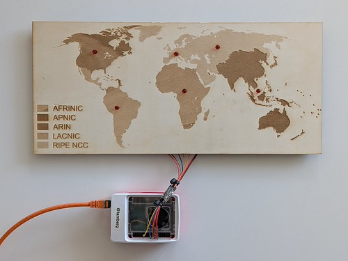
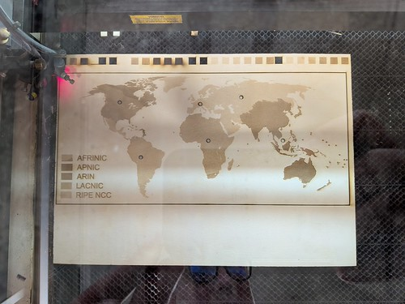
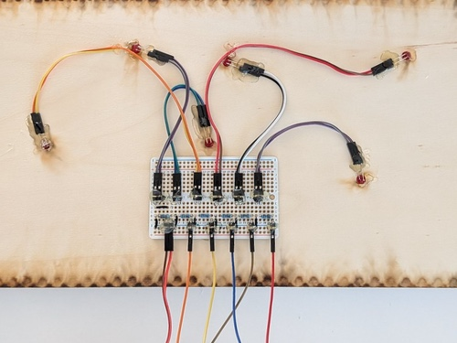

# NICs Map
A physical map that shows the [network information center](https://en.wikipedia.org/wiki/InterNIC) / [regional internet registry](https://en.wikipedia.org/wiki/Regional_Internet_registry) responsible for the [IPv4 address](http://www.iana.org/assignments/ipv4-address-space) of incoming TCP connections on a specific port based on the first byte of the remote IP address.

Address space information based on [IANA assignments](http://www.iana.org/assignments/ipv4-address-space) licensed under [their licensing terms](https://www.iana.org/help/licensing-terms).



## Map
Map [design files](map) by [T. Amberg](https://www.tamberg.org) licensed [CC BY-SA 4.0](https://creativecommons.org/licenses/by-sa/4.0/deed.en), based on [this map](https://en.wikipedia.org/wiki/Regional_Internet_registry#/media/File:Regional_Internet_Registries_world_map.svg) by [Wikipedia.org](https://en.wikipedia.org/) licensed [CC BY-SA 3.0](https://creativecommons.org/licenses/by-sa/3.0/deed.en), edited on [Inkscape](https://inkscape.org), laser-cut at [FabLab Zürich](https://zurich.fablab.ch).
```
map
├── map_nics.svg # w/ layers
├── map_nics_afrinic.svg
├── map_nics_apnic.svg
├── map_nics_arin.svg
├── map_nics_frame.svg
├── map_nics_holes.svg
├── map_nics_lacnic.svg
├── map_nics_ripe-ncc.svg
└── map_nics_text.svg
```


## Wiring
Use 6 5mm LEDs with a 1k resistor each, connect GND and GPIO pins 5, 22, 23, 24, 25 and 27.

See [this pinout](https://pinout.xyz) for the Pi.



## Testing
Test each pin with [pinctrl](https://github.com/raspberrypi/utils/tree/master/pinctrl).

Set GPIO pin 23 as output.
```console
$ pinctrl set 23 op
```

Set GPIO pin 23 to high.
```console
$ pinctrl set 23 dh
```

Set GPIO pin 23 to low.
```console
$ pinctrl set 23 dl
```

## Code
Build [nics.c](nics.c) on Linux
```console
$ gcc -o nics nics.c
```
Run on Linux
```console
$ ./nics
```

Test on Linux
```console
$ curl -v 127.0.0.1:8080/#{0..999}
```
